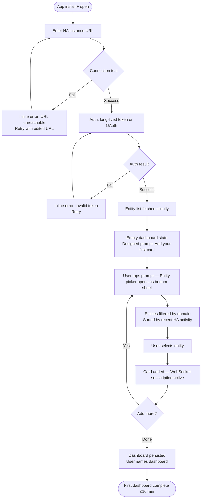
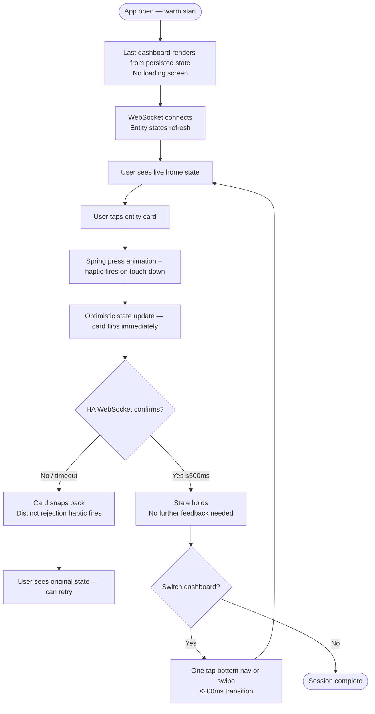
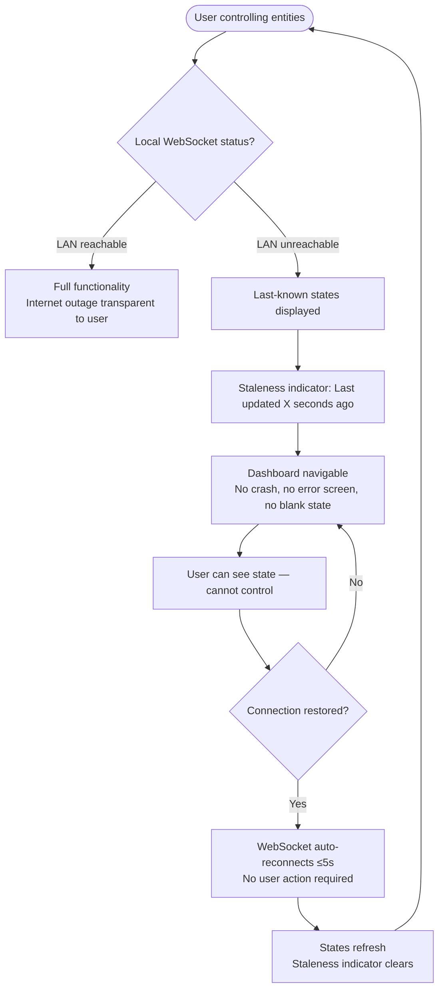
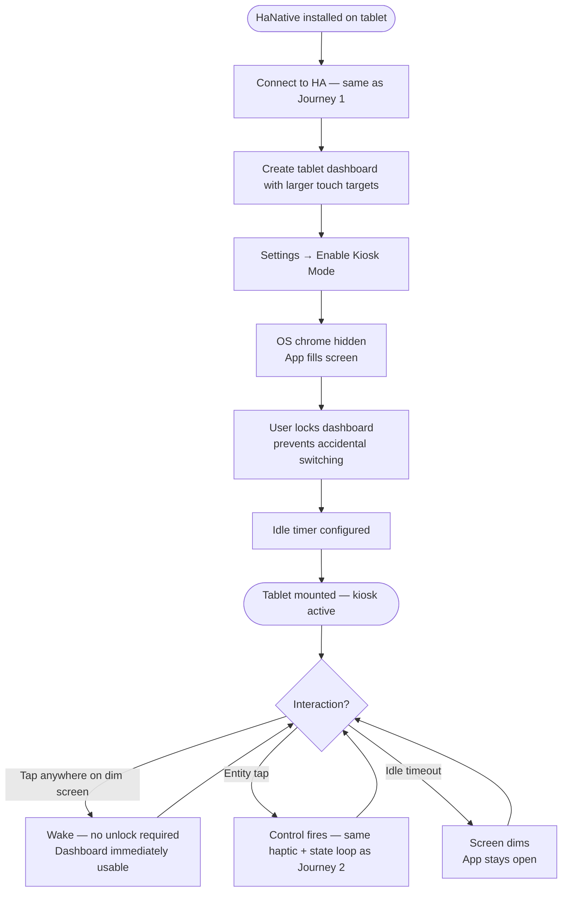

# UX Design Specification HaNative

**Author:** Jeremy Blanchard
**Date:** 2026-04-21

---

<!-- UX design content will be appended sequentially through collaborative workflow steps -->

## Executive Summary

### Project Vision

HaNative is a native KMP + Compose Multiplatform control interface for Home Assistant, built for power users who've accepted years of mediocre mobile UX because HA's backend is unmatched. The app replaces the WebView companion app as the primary device control surface — same entities, same connectivity, but wrapped in an interface that feels physical: spring physics, per-entity haptic feedback, immediate state reflection, and one meticulously crafted theme. V1 ships the experience layer. V2 ships the designer marketplace — an open SDK enabling Compose developers to sell signed, versioned dashboard templates to users who want premium aesthetics without needing to be UI designers.

### Target Users

**Primary — HA Power Users:** Technically fluent developers, sysadmins, and home automation enthusiasts managing 100+ entities. YAML-literate. They've built complex automations and live in HA forums and r/homeassistant. They tolerate bad mobile UX because no alternative exists. They evangelize loudly when something is good — word-of-mouth is the only growth channel that matters.

**Secondary (V2) — Dashboard Designers:** Compose developers with design sensibility who want a ready-made audience and recurring passive income from selling premium templates to a community that can't build them.

### Key Design Challenges

1. **Onboarding to first dashboard in ≤10 minutes, unaided** — connecting to HA, authenticating, then presenting potentially 180+ entities without overwhelming. Activity-sorted entity picker and a designed empty state (not a blank screen) are the primary mechanisms.
2. **Dashboard builder discoverability** — card-based builder must feel obvious to power users encountering it cold. No documentation, no tutorial — the builder itself is the affordance.
3. **Trust signals during disconnection** — stale state must communicate clearly without triggering panic. Users need to know what the app knows and when it last knew it. Silence is worse than honest staleness.
4. **Multi-surface coherence** — phone, home screen widget, and wall tablet kiosk share one theme but have radically different interaction contexts. Theme component contract must hold across all three without feeling stretched.

### Design Opportunities

1. **Physical feedback as primary differentiator** — no competing HA client has choreographed haptics or spring physics. The "feel" moment (tapping a light card and sensing the confirmation) is the screenshot trigger that drives forum posts and beta evangelism.
2. **Context engine using HA's own mental model** — rule builder mirrors HA automation condition syntax. Power users already know if/then/entity-state. Zero learning curve = adoption without friction.
3. **Empty state as first impression** — the designed empty state on first launch sets the product's emotional tone before the user has built anything. Opportunity to signal quality that no other HA client has used.

## Core User Experience

### Defining Experience

The core user action is single entity control — a tap to toggle a light, nudge a thermostat, trigger a scene. This is the most frequent interaction in the app and the product's primary trust signal. The PRD's ≤500ms state confirmation + haptic feedback requirement exists entirely because this moment either earns or destroys user confidence. Everything else — dashboards, context engine, widgets — is scaffolding around this loop.

### Platform Strategy

- **Primary platform:** Android (V1 launch target); iOS follows when CMP quality bar is met — no fixed deadline
- **Input model:** Touch-first, full-screen; no mouse/keyboard consideration for V1
- **Surfaces:** Phone (primary), home screen widget (Glance/WidgetKit), wall tablet kiosk (Growth)
- **Offline strategy:** Graceful degradation — last-known state with staleness timestamp, never crash, never blank screen. Full offline not a goal; honest partial-offline is.
- **Platform capabilities leveraged:** Haptic engine (Android `VibrationEffect` / iOS `UIFeedbackGenerator`), `WAKE_LOCK` for kiosk keep-awake, home screen widget APIs

### Effortless Interactions

- **Dashboard switching** — one tap, no navigation stack, ≤200ms. Switching dashboards should feel like changing rooms, not navigating menus.
- **Entity state reading** — no pull-to-refresh, no manual sync. WebSocket push means state is always current without user effort.
- **Network recovery** — automatic WebSocket reconnection within 5 seconds. User should never need to restart the app or manually reconnect.
- **First dashboard creation** — activity-sorted entity picker surfaces the most relevant entities first. Designed empty state guides the first card add. No documentation required.

### Critical Success Moments

1. **First control tap** — entity responds, haptic fires, card state updates before the user's attention has shifted. This is the "oh" moment that becomes the forum post screenshot.
2. **First dashboard in ≤10 minutes** — unaided, no external help. Designed empty state → entity picker → 5 relevant cards → working personal dashboard.
3. **Transparent disconnection and recovery** — internet drops mid-session. App shows last-known state with honest timestamp. Reconnects automatically. User never leaves HaNative, never sees an error screen.

### Experience Principles

1. **Response before doubt** — every control action delivers visible + physical confirmation before the user wonders if it registered. ≤500ms state update + haptic = trust.
2. **Home state is truth** — what the screen shows is what the home is doing. When the app doesn't know, it says so honestly (staleness indicator) rather than showing false confidence or silence.
3. **Zero dead ends** — no error screens, no blank states, no navigation traps. Every disconnected or empty state is navigable and recoverable in one gesture.
4. **Power user intuition** — HA users already speak if/then/entity-state. The context engine rule builder, entity picker, and dashboard logic mirror HA's own mental model. No new vocabulary required.

## Desired Emotional Response

### Primary Emotional Goals

The primary emotional target is **physical confidence** — "my home heard me." Not delight in the app itself, but certainty that the home responded. The product should disappear into the background; only the outcome is felt. This is a power tool for people who built serious home automation setups. They want competence, not whimsy.

### Emotional Journey Mapping

| Moment | Target Feeling |
|---|---|
| First launch / onboarding | Intrigue — "this looks different from every other HA client" |
| First control tap with haptic | Surprise — "oh, this *feels* right" |
| First dashboard complete | Ownership — "this is mine, I built it" |
| Daily use (week 3+) | Invisibility — tool so reliable it stops being consciously noticed |
| Disconnection / stale state | Calm trust — "the app is being honest with me" |
| Network recovery | Relief — automatic, no user action required |

### Micro-Emotions

- **Trust over skepticism** — honest stale-state indicators and timestamps eliminate doubt about whether the displayed state reflects reality
- **Confidence over confusion** — activity-sorted entity picker, designed empty states, and zero dead ends mean users always know what to do next
- **Satisfaction over delight** — power users want a capable tool, not a charming toy; emotional rewards come from accomplishment, not animation
- **Belonging over isolation** — the "forum post moment" (screenshot of first working dashboard) is a real social signal; design must create shareable success moments

### Design Implications

- **Confidence** → haptic + visual confirmation on every control action, ≤500ms, no exceptions — uncertainty after a tap is a trust failure
- **Trust** → stale state displayed honestly with timestamp; never silently outdated; the app says what it knows and when
- **Ownership** → dashboard builder produces named, persistent, user-customized surfaces — not presets or templates the user merely filled in
- **Invisibility** → automatic reconnection, WebSocket push updates, zero manual refresh — the app maintains itself so users forget it needs maintaining

### Emotional Design Principles

1. **The app earns trust, then disappears** — every interaction that delivers accurate, fast, physical confirmation moves HaNative from "tool I use" to "part of my home"
2. **Honesty over optimism** — a stale timestamp is better than a confident lie; the emotional cost of betrayal (wrong state shown) is irreversible
3. **Competence as delight** — for this user, the emotional payoff of a thing working perfectly is more powerful than any animation or onboarding flourish
4. **The shareable moment is designed** — the first haptic confirmation, the first completed dashboard, the first kiosk mounting: these are real social triggers for this community and must be treated as intentional design outcomes

## UX Pattern Analysis & Inspiration

### Inspiring Products Analysis

**Apple Home**

What works well: tile/card layout makes entity state scannable at a glance without requiring interaction; room-based grouping mirrors users' existing mental model of their home; Control Center integration enables glanceable control without opening the app (direct precedent for HaNative's widget strategy); haptic feedback on toggle actions establishes the physical feedback baseline HaNative must exceed; spring press animations feel physical rather than decorative.

What fails: zero layout customization — tiles are fixed size, fixed position, Apple-determined; state staleness shown silently with no indicator; no concept of context — the same interface appears morning and night regardless of home state.

**Google Home**

What works well: Favorites tab surfaces frequently-used devices via activity-based logic — the same principle driving HaNative's activity-sorted entity picker; bottom navigation keeps primary surfaces reachable with one thumb tap; Material You information density is high without feeling cluttered.

What fails: navigation structure has been redesigned three or more times — power users have extremely low tolerance for this; routine/automation builder is buried deep and feels like a separate product rather than a natural extension of control; device-discovery-first framing prioritizes adding devices over controlling them.

### Transferable UX Patterns

| Pattern | Source | Apply To HaNative |
|---|---|---|
| Tile/card layout with at-a-glance state | Apple Home | Dashboard card design — entity state visible without tap |
| Spring press animation on controls | Apple Home | Entity card tap feedback — match then exceed |
| Activity-based surface surfacing | Google Home | Entity picker activity sort + dashboard card ordering |
| Bottom nav — primary surfaces one tap | Google Home | Dashboard switcher placement |
| Room/space mental model | Apple Home | Named dashboards ("Morning", "Living Room") over entity IDs |

### Anti-Patterns to Avoid

- **Silent stale state** (Apple Home) — HaNative must always timestamp staleness; never display false confidence when HA is unreachable
- **Locked layout** (Apple Home) — power users need free card reorder and removal; fixed tile grids create resentment in technically fluent users who expect control
- **Automation buried as separate mode** (Google Home) — context engine rule builder must feel like a first-class extension of dashboard building, not a different product within the app
- **Navigation churn** (Google Home) — commit to nav structure in V1 and do not move primary surfaces; power users build muscle memory and treat nav changes as regressions

### Design Inspiration Strategy

**Adopt:**
- Card/tile layout with state-at-a-glance (Apple Home) — proven pattern for entity control surfaces
- Bottom navigation for dashboard switching (Google Home) — one-thumb primary surface access
- Activity-based entity surfacing (Google Home Favorites) — reduces friction from 180-entity lists to relevant-first

**Adapt:**
- Spring press feedback (Apple Home) — implement in Compose with per-entity haptic choreography, not a single generic tap response
- Room mental model (Apple Home) — reframe as user-named dashboards, not Apple-imposed room categories; user owns the taxonomy

**Avoid:**
- Fixed layout grids — power users need reorder and remove
- Silent staleness — always timestamp; never lie
- Automation as separate mode — context rules belong in the dashboard flow
- Post-launch nav restructuring — decide structure in V1, commit to it

## Design System Foundation

### Design System Choice

**Material 3 as scaffold with fully custom visual layer** — M3 provides interaction behavior and layout primitives; all visual expression (color tokens, typography, shape, motion, haptic contracts) is custom-authored as part of the theme component contract.

### Rationale for Selection

- **V2 SDK requires defined component contracts.** The V1 internal theme is the reference implementation of what V2 designers will implement. M3's `MaterialTheme` token architecture (`ColorScheme`, `Typography`, `Shapes`) maps directly onto a publishable SDK contract surface — the design system choice and the SDK architecture are the same decision.
- **M3 primitives are proven and accessible.** Touch target sizing, focus handling, accessibility semantics, and interaction state behavior are handled by M3 components. Building these from scratch for a solo developer adds risk without design differentiation.
- **Custom visual layer delivers unique aesthetic.** M3 components are fully themeable. Colors, shapes, typography, and motion are entirely custom — the M3 scaffold is invisible to users. The "one curated theme" product promise is achievable without rebuilding interaction primitives.
- **Compose Multiplatform compatibility.** M3 for Compose Multiplatform (`androidx.compose.material3`) is the natural foundation for a KMP + CMP project targeting Android and iOS from a shared codebase.

### Implementation Approach

- Use `MaterialTheme` as the theme provider; define custom `ColorScheme`, `Typography`, and `Shapes` tokens as the V1 theme
- All entity card components built on M3 surface/container primitives with fully custom visual styling
- Motion and haptic behavior defined in a `ThemeContract` interface — this interface is the V2 SDK's primary extension point
- No M3 component used at its visual default — every component is themed to the custom system before any screen is designed

### Customization Strategy

- **Design tokens first:** Define the complete token set (color roles, type scale, corner radii, elevation, spacing) before building any screen — tokens are the SDK contract surface
- **Component contract as API:** Each entity card type defines its required state variants, size buckets (compact/standard/expanded), and haptic contract — the same contract V2 designers will implement
- **Motion as first-class token:** Spring stiffness, damping, haptic intensity per entity domain — authored in the theme, not in individual composables
- **Platform bridges isolated:** Haptic implementation (`VibrationEffect` on Android, `UIFeedbackGenerator` on iOS) lives behind a `HapticEngine` `expect/actual` interface — theme contract calls the interface, not the platform API directly

## 2. Core User Experience

### 2.1 Defining Experience

**"Tap a card. Your home responds."**

HaNative's defining experience is the entity control tap — a single interaction that either earns or destroys the user's trust in the product. HA power users arrive with years of WebView-trained expectations: latency, friction, uncertainty. Every tap that delivers state confirmation before doubt forms is a trust deposit that moves HaNative from "app I use" to "part of my home."

### 2.2 User Mental Model

HA power users trust the platform deeply — they've built complex automations, managed hundreds of entities, and invested years of configuration. Their frustration is not with HA; it's with the interface gap. The WebView companion app trained them to expect latency, so their baseline expectation when opening any HA mobile client is "this will probably lag."

Current workarounds: browser on phone, wall-mounted browser kiosk, reluctant companion app use. HaNative replaces the workaround, not the platform.

The context engine and app-as-HA-entity patterns require zero user education because they extend the mental model power users already possess — if/then entity-state logic is exactly how HA automations work. The UI layer simply becomes another automation target.

### 2.3 Success Criteria

- State updates before the thumb lifts — the action registers *during* the tap, not after
- Haptic feedback is entity-typed — toggling a light feels physically distinct from locking a door; the haptic carries semantic meaning, not just confirmation
- No loading state on control — optimistic update on tap, reconciles with HA WebSocket truth in background
- Dashboard is where the user left it on reopen — no navigation to reconstruct, no loading screen, immediate surface

### 2.4 Novel UX Patterns

| Layer | Pattern Type | What's Different |
|---|---|---|
| Card tap to toggle | Established | Spring physics + entity-typed haptic replaces generic tap response |
| Dashboard as named surface | Established | User-owned taxonomy; not app-imposed room categories |
| Context-aware dashboard switching | **Novel** | Dashboard transitions automatically based on live HA entity state rules — no other HA client implements this |
| App registered as HA entity | **Novel** | HA automations can trigger interface transitions — the UI is a first-class participant in the HA automation graph |

Novel patterns require no user education: both leverage the if/then entity-state mental model power users already use when writing HA automations.

### 2.5 Experience Mechanics

**The core entity control tap — step by step:**

**1. Initiation**
User sees entity card showing current live state (light = on, thermostat = 21°, lock = locked). State is pushed via WebSocket — no manual refresh, no staleness risk under normal connectivity.

**2. Interaction**
User taps card. Compose spring animation compresses card on press contact. Haptic fires on touch-down (not release) — entity-domain-typed, sourced from theme haptic contract, not a generic system tap.

**3. Feedback**
Card optimistically updates to new state immediately. No spinner, no progress bar. If HA WebSocket confirms: state holds. If HA rejects (e.g., entity unavailable): card snaps back to prior state with a distinct rejection haptic — semantically different from the success haptic.

**4. Completion**
Card displays confirmed state. No toast, no notification, no modal. The card *is* the confirmation. Completion is visual + physical, not verbal.

## Visual Design Foundation

### Color System

**Direction: Deep + Warm** — Navy/slate base with amber accent. Premium, residential feel.

| Role | Token | Value | Use |
|---|---|---|---|
| Background | `color.background` | `#0D1117` | App background |
| Surface | `color.surface` | `#161B22` | Cards, inactive states |
| Surface elevated | `color.surfaceElevated` | `#1C2333` | Buttons, header buttons, overlays |
| Surface active | `color.surfaceActive` | `#2D1E06` | Active/on entity cards |
| Accent | `color.accent` | `#F59E0B` | Active state text, toggles on, temp values |
| Text primary | `color.textPrimary` | `#E6EDF3` | Headings, card values, dashboard name |
| Text secondary | `color.textSecondary` | `rgba(230,237,243,0.5)` | Card labels, metadata, status text |
| Connected | `color.connected` | `#3FB950` | Local connection pill |
| Border subtle | `color.border` | `#21262D` | Nav divider, card borders |
| Toggle off | `color.toggleOff` | `#30363D` | Inactive toggle track |

### Typography System

**Typeface: Inter** — geometric sans, high legibility at small sizes, available cross-platform in KMP.

| Role | Size | Weight | Use |
|---|---|---|---|
| Dashboard name | `20sp` | `800` | Screen heading |
| Card value | `13sp` | `800` | Entity state (On · 80%, Locked, 21°) |
| Card label | `11sp` | `500` | Entity name label |
| Status / metadata | `10sp` | `600` | Connection pill, timestamps |
| Nav label | `9sp` | `700` | Bottom nav items |
| Temp / large value | `20sp` | `800` | Thermostat card temp display |

Strong heading/body weight contrast — numbers and states read heavy against muted labels. Dashboard name uses negative letter-spacing (`-0.02em`) for premium density feel.

### Spacing & Layout Foundation

- **Base unit:** `8dp`
- **Card internal padding:** `14dp`
- **Card gap:** `8dp`
- **Screen horizontal padding:** `12dp`
- **Card corner radius:** `18dp` — soft, premium, not sharp
- **Bottom nav padding:** `12dp top / 16dp bottom`
- **Minimum touch target:** `48dp` on all interactive elements (toggles, temp buttons, nav items)
- **Density:** Comfortable — generous internal padding, clear breathing room between cards

### Accessibility Considerations

- Amber `#F59E0B` on `#0D1117` background: contrast ~6.5:1 — passes WCAG AA (normal + large text)
- Primary text `#E6EDF3` on `#161B22` surface: contrast ~11:1 — passes WCAG AAA
- Toggle knob (white on amber active track): sufficient contrast for interaction state recognition
- All interactive elements meet 48dp minimum touch target — no exceptions for density
- Stale-state indicator must meet same contrast requirements as primary text — never use opacity-only dimming to signal staleness

## Design Direction Decision

### Design Directions Explored

Four distinct layout directions were explored, all using the established Deep + Warm color system:

- **D1 — Grid + Bottom Nav:** 2-col card grid with bottom tab navigation. Familiar Apple Home-like pattern, highest entity density, most scannable.
- **D2 — Dashboard Tabs + List:** Dashboard names as tab row at top, full-width list cards with more entity detail per row. Context engine badge surfaces naturally at bottom.
- **D3 — Hero Card + Mini Grid:** Primary entity promoted to large hero card, secondary entities in a 3-col compact grid. Strong visual hierarchy for users with one dominant entity per dashboard.
- **D4 — Minimal / Ambient:** Entities grouped by type, list-row cards with subtle border treatment, near-black background, strong typographic dashboard name hierarchy. Most "invisible tool" aesthetic.

### Chosen Direction

**D4 — Minimal / Ambient** is the V1 reference theme.

Key visual elements carried forward:
- Entity grouping by domain type (Lights / Climate & Security / etc.)
- Strong typographic hierarchy on dashboard name — large, bold, generous header breathing room
- Near-black `#090C12` base (slightly deeper than the base color system token)
- List-row cards with 1px border (`rgba(255,255,255,0.05)`) — clean separation without heavy card chrome
- Amber accent + toggle on active entities; inactive entities fully recede
- Bottom navigation retained (Dash / Rooms / Settings)
- Context badge ("No Context Active" / active context name) in header — surfaces context engine without a dedicated screen

### Design Rationale

D4 is the correct choice for HaNative's emotional goals and user type:

- **Competence over delight:** Power users want a tool that disappears into use. D4 recedes maximally — the home state is what's visible, not the app's chrome.
- **Information hierarchy:** Domain grouping (Lights, Climate, Security) matches the mental model power users already use when building their HA setup. They think in domains, not arbitrary card order.
- **V2 SDK alignment:** D4's list-row card architecture is the simplest component contract to extend. Designers implementing V2 templates can evolve layout while the entity-row pattern stays as the baseline.

### Implementation Approach

- D4 is the V1 internal theme and the V2 SDK reference implementation
- All component contracts (card types, state variants, size buckets, haptic contracts) are authored against D4 first
- Customizability is a V2 SDK property — V1 ships one locked theme; users cannot modify visual appearance in V1
- The layout itself (grouping by domain, list rows vs. grid) may evolve in V2 themes; the interaction contract (tap → haptic → state update) is fixed across all themes

## User Journey Flows

### Journey 1 — First Launch → First Dashboard

**Flow optimisations:** No onboarding screens — straight to URL entry. Auth errors shown inline on the field, not modals. Activity sort surfaces living room lights first for a typical home. Dashboard name prompted after first card added, not before.

---

### Journey 2 — Daily Control Loop

**Flow optimisations:** Warm start renders from cache immediately. Optimistic update reflects intent before network round-trip. Rejection haptic is semantically distinct from success haptic — user understands without reading anything.

---

### Journey 3 — Network Drop + Recovery

**Flow optimisations:** Internet outage never surfaces if LAN is live. Stale indicator shows timestamp ("43s ago") not generic "offline" — honest and specific. No retry button — reconnect is fully automatic. Dashboard layout never collapses or clears.

---

### Journey 4 — Kiosk Tablet Setup *(Growth)*

**Flow optimisations:** Kiosk mode is a single settings toggle. Dashboard lock is independent from kiosk mode. Tap-to-wake fires from any screen region, not a dedicated button.

---

### Journey Patterns

**Entry patterns:**
- All journeys enter through persisted, cached state — no loading screens on return visits
- First-run only shows blank/prompt state once; all subsequent opens render last known dashboard

**Feedback patterns:**
- Touch-down haptic (not release) — confirmation fires before the tap gesture completes
- Optimistic update + possible snap-back — intent reflected instantly, truth reconciled silently in background
- Staleness timestamp over generic "offline" label — specificity builds trust

**Recovery patterns:**
- Errors shown inline on the triggering element — no modals, no toasts
- Network recovery is always automatic — no user-initiated retry required
- Rejection haptic is semantically distinct from success haptic — no visual reading required to understand outcome

### Flow Optimisation Principles

1. **Fewest steps to first value** — URL → Auth → Dashboard in 3 screens, no interstitials
2. **State always visible** — even in degraded connectivity, dashboard renders with honest staleness timestamp
3. **Physical feedback precedes visual feedback** — haptic on touch-down means confirmation arrives before the eye processes the card state change
4. **No modals for errors** — inline field errors only; modals interrupt flow and require deliberate dismissal

## Component Strategy

### Design System Components

M3 components used as scaffold — fully themed, never at visual defaults:

| Component | M3 Source | Used For |
|---|---|---|
| `Scaffold` | M3 | Screen layout, bottom bar slot |
| `NavigationBar` + `NavigationBarItem` | M3 | Bottom nav (Dash / Rooms / Settings) |
| `BottomSheetScaffold` / `ModalBottomSheet` | M3 | Entity picker, card config, context rule builder |
| `TextField` | M3 | HA URL entry, auth token input |
| `CircularProgressIndicator` | M3 | Auth/connection loading — only location a loading indicator appears |
| `SnackbarHost` | M3 | Transient system messages (connection status changes) |
| `DropdownMenu` | M3 | Dashboard overflow actions (rename, delete) |

### Custom Components

**EntityCard** — highest priority, most critical component

The core interaction surface. Row-based layout (D4 direction). Two sizes: standard and compact.

- **States:** `default`, `active` (entity on), `stale` (disconnected, last-known state), `optimistic` (action sent, awaiting confirmation), `error` (action rejected, snapping back)
- **Variants:** `toggleable` (light, switch, input_boolean), `read-only` (sensor, binary_sensor), `stepper` (climate temperature), `trigger` (script, scene), `media` (media_player)
- **Haptic contract:** Each variant defines its haptic signature via `HapticContract` — provided by theme, not hardcoded in composable. Theme owns the physical feel.
- **Anatomy:** `[domain-icon] [entity-name + state-label] [right-action: toggle | stepper | value]`
- **Stale state:** Row dims to 50% opacity + inline staleness timestamp — no separate overlay, no full-screen degraded state

**EntityPicker** — bottom sheet, opens from empty state or add-card affordance

- **States:** `loading`, `loaded`, `empty` (no entities in domain), `search-active`
- **Filter chips:** one per supported domain at top — tapping filters entity list below
- **Row anatomy:** same visual language as EntityCard (`[icon] [name] [current-state]`) — no new patterns to learn
- **Sort:** activity-sorted by default (most recently active HA entities first)

**DashboardSwitcher** — bottom nav active tab behaviour

- Active tab shows current dashboard name, not a fixed "Dash" label
- Tapping active tab opens bottom sheet listing all named dashboards
- **States:** `active-dash`, `sheet-open`
- **Growth variant:** context badge pill above icon when context engine has an active context

**StaleStateIndicator** — inline header component

- **States:** `connected` (hidden — zero footprint), `stale` ("Last updated Xs ago" — live counter), `reconnecting` (spinner + "Reconnecting…")
- Replaces connection pill in header — same position, same size, no layout shift
- Timestamp updates every second while stale — not a static message

**EmptyDashboardState** — first-run dashboard invitation

- Not an error state — a designed prompt
- Single centered call-to-action: "Add your first card" with `+` affordance
- Secondary hint: "Your most-used entities appear first"
- Tapping anywhere in the prompt area opens EntityPicker

**HapticEngine (expect/actual)** — platform bridge, not a UI component

Critical for theme contract integrity across Android and iOS:
- `expect fun HapticEngine.fire(pattern: HapticPattern)`
- `HapticPattern`: `ToggleOn`, `ToggleOff`, `StepperInc`, `StepperDec`, `ActionTriggered`, `ActionRejected`, `DashboardSwitch`
- Android actual: `VibrationEffect` with per-pattern waveform and amplitude
- iOS actual: `UIImpactFeedbackGenerator` / `UINotificationFeedbackGenerator` per pattern type
- Theme contract calls `HapticEngine` interface — never platform API directly

### Component Implementation Strategy

- All custom components consume M3 design tokens — no hardcoded color/spacing values
- `EntityCard` is the V2 SDK's primary extension point — its `HapticContract` and state variant interfaces are what V2 designers implement
- Components are stateless where possible — state hoisted to ViewModel layer; composables receive state + callbacks only
- Each component ships with a `@Preview` covering all states — previews double as visual regression reference

### Implementation Roadmap

**Phase 1 — MVP critical path**
- `EntityCard` (all variants) — Journey 1 + 2 blocked without this
- `EntityPicker` bottom sheet — Journey 1 blocked without this
- `EmptyDashboardState` — first-run experience
- `StaleStateIndicator` — Journey 3 (trust signal during disconnection)
- `HapticEngine` expect/actual bridges — core differentiator, must ship in Phase 1

**Phase 2 — Dashboard management**
- `DashboardSwitcher` bottom sheet with named dashboards
- Dashboard rename/delete via M3 `DropdownMenu` + `TextField`
- Home screen widget surface (Glance / WidgetKit — separate component tree)

**Phase 3 — Growth features**
- Context rule builder composable (HA automation condition UI pattern)
- Context badge variant on `DashboardSwitcher`
- Kiosk mode overlay + dim-on-idle behaviour
- Demo onboarding flow with simulated entity data

## UX Consistency Patterns

### Action Hierarchy

HaNative is a control surface — minimal primary actions, no productivity chrome.

| Level | Visual | Used For |
|---|---|---|
| **Primary** | Amber `#F59E0B` fill | Entity active state, single CTA per screen |
| **Secondary** | `#1C2333` surface | Dashboard actions, add card, header icon buttons |
| **Destructive** | Amber text + confirmation required | Delete dashboard — irreversible actions only |
| **Ghost / inline** | Text only, reduced opacity | Stepper `−`/`+` controls on cards |

No floating action buttons. No full-width primary buttons except auth screen (URL connect / authenticate).

### Feedback Patterns

| Situation | Pattern | Never Use |
|---|---|---|
| Entity control success | Haptic (touch-down) + optimistic card state update | Toast, snackbar, animation overlay |
| Entity control rejected | Snap-back animation + rejection haptic | Error modal, error toast |
| Network connected | Connection pill (green `Local · 12ms`) in header | Banner, modal |
| Network stale | `StaleStateIndicator` replaces pill — amber, live timestamp | Blank screen, error screen |
| Network reconnecting | Spinner in indicator pill + "Reconnecting…" | Progress bar, blocking overlay |
| Auth error | Inline field error below text field | Modal, full-screen error |
| Dashboard persisted | Silent — no confirmation | "Saved!" toast |

Rule: No modals for recoverable states. Modals only for destructive confirmations (delete dashboard).

### Form Patterns

Only two forms in V1: HA URL entry and auth token input.

- **Validation:** Inline, below field, on blur — never on keystroke
- **Error text:** Plain language ("Can't reach this address" not "ERR_CONNECTION_REFUSED")
- **Progress:** `CircularProgressIndicator` replaces submit button during async ops — button disabled, not hidden
- **Success:** Silent navigation forward — no "Success!" screen
- **Keyboard:** `ImeAction.Go` on last field triggers submit — no separate submit tap required

### Navigation Patterns

- **Bottom nav** — primary surface switching (Dash / Rooms / Settings). Persists across all screens.
- **Bottom sheets** — entity picker, dashboard switcher, card config, context rule builder. Never full-screen push for these flows.
- **Back navigation** — bottom sheets dismiss on swipe-down or back gesture. No back button in header.
- **Dashboard switching** — tap active bottom nav item → sheet with dashboard list → one-tap selection → ≤200ms transition.
- **No nested navigation stacks** — all flows are flat or modal. Power users must never feel lost.

### Empty & Loading States

| State | Treatment |
|---|---|
| First-run dashboard | `EmptyDashboardState` — designed invitation, not a blank screen |
| All cards removed | Same `EmptyDashboardState` prompt |
| Entity picker loading | Skeleton rows (shimmer) — not a spinner |
| Entity picker empty domain | "No [domain] entities found in your HA" with domain icon |
| App open, HA unreachable | Last-known dashboard + `StaleStateIndicator` — never empty |
| App first open, no cache | Only case showing a spinner — `CircularProgressIndicator` centred on background |

Rule: There is always something on screen. Blank is never an acceptable state.

### Motion & Transition Patterns

All motion sourced from theme contract — not per-screen decisions.

| Transition | Behaviour |
|---|---|
| Dashboard switch | Cross-fade ≤200ms — no slide (avoids implying spatial hierarchy) |
| Bottom sheet open | Spring slide-up: `stiffness=400, dampingRatio=0.8` |
| Bottom sheet dismiss | Spring slide-down — same spring |
| Entity card press | Spring scale compress on touch-down: `stiffness=600, dampingRatio=0.7` |
| Entity card state change | Animated colour transition: `tween(200ms, EaseInOut)` |
| Snap-back on rejection | Spring bounce: `stiffness=500, dampingRatio=0.6` — physically communicates rejection |
| `StaleStateIndicator` appear | Fade in: `tween(300ms)` |

Rule: Every animation has a semantic justification. Motion communicates meaning, not decoration.

### Touch Interaction Patterns

- **Minimum touch target:** 48dp × 48dp on all interactive elements — no exceptions
- **Toggle tap area:** Full card row is tappable, not just the toggle widget
- **Stepper:** `−` and `+` are individual 48dp targets; long-press not in V1
- **Swipe to dismiss:** Not implemented on cards — accidental deletion risk outweighs convenience
- **Pull to refresh:** Not implemented — WebSocket push eliminates the need entirely

## Responsive Design & Accessibility

### Responsive Strategy

HaNative has three distinct surfaces — each is a first-class design target, not a responsive adaptation of another:

| Surface | Screen size | Layout approach |
|---|---|---|
| **Phone** (primary) | 360–430dp width | Single column, bottom nav, D4 list-row layout |
| **Home screen widget** | Glance/WidgetKit size buckets | Separate component tree — glanceable state, tap-to-open only |
| **Wall tablet kiosk** *(Growth)* | 800–1280dp width | Expanded grid, larger touch targets, fullscreen, no bottom nav |

No web, desktop, or iPad split-view in V1. iOS phone timing TBD; tablet is Growth.

### Breakpoint Strategy

Compose `WindowSizeClass` (not CSS pixel breakpoints):

| Class | Width | Layout |
|---|---|---|
| `COMPACT` | < 600dp | Phone — single column, bottom nav |
| `MEDIUM` | 600–840dp | Not targeted V1 — falls back to COMPACT |
| `EXPANDED` | > 840dp | Tablet kiosk — multi-column, navigation rail *(Growth)* |

Widget surfaces use Glance size buckets and WidgetKit size families independently of `WindowSizeClass`.

### Accessibility Strategy

**Target: WCAG 2.1 AA**

**Contrast (confirmed):**
- Amber `#F59E0B` on `#0D1117`: ~6.5:1 — AA ✓
- Primary text on surface `#161B22`: ~11:1 — AAA ✓
- Secondary text at 50% opacity: ~5.5:1 — AA large ✓, monitor at implementation

**Screen reader (TalkBack / VoiceOver):**
- `EntityCard` variants: `contentDescription` = entity name + state ("Living Room light, on at 80%")
- Toggle affordance: `Role.Switch` + `stateDescription` ("on" / "off")
- `StaleStateIndicator`: announces "Connection lost. Last updated 43 seconds ago."
- `EmptyDashboardState` prompt: reads as button ("Add your first card")
- Bottom nav: M3 `NavigationBarItem` semantics — handled by framework

**Focus & keyboard:**
- All interactive elements reachable via sequential focus
- Focus indicator: 2dp amber outline on focused element
- No keyboard traps in bottom sheets — back gesture / Escape dismisses

**Dynamic text size:**
- Support Android `fontScale` up to 1.3× — no layout breaks
- Card labels truncate with ellipsis at 1×; at 1.3× labels may wrap to 2 lines with min-height adjustment

**Colour independence:**
- Active state: amber + toggle position + surface colour change — not colour alone
- Stale state: timestamp text + icon — not colour alone
- Rejection: snap-back animation + haptic — not colour alone

### Testing Strategy

**Device targets:**
- Android phone: Pixel 6–8 range; 360dp, 390dp, 430dp widths
- Android tablet: Fire HD 10 (kiosk validation)
- iOS: iPhone 14/15 when iOS build active

**Accessibility testing:**
- TalkBack on Android — full entity control flow eyes-closed
- VoiceOver on iOS — same
- Font scale 1.3× — confirm no layout breaks
- High contrast mode — confirm legibility

**Performance validation (UX-critical):**
- Entity control → state confirmation: ≤500ms on LAN
- Dashboard switch: ≤200ms
- Warm start to first render: ≤1s

### Implementation Guidelines

**Compose:**
- `Modifier.semantics { contentDescription = "…"; role = Role.Switch; stateDescription = "…" }` on all `EntityCard` variants
- `Modifier.minimumInteractiveComponentSize()` (M3 built-in) — enforces 48dp touch target floor
- `WindowSizeClass` from `androidx.compose.material3.windowsizeclass` — queried in `MainActivity`, passed via `CompositionLocal`
- All text in `sp` units; all layout in `dp` — never lock text to `dp`
- Kiosk keep-awake: `WindowManager.LayoutParams.FLAG_KEEP_SCREEN_ON` + `WAKE_LOCK`

**Widget (Glance):**
- Separate composable tree from phone UI — no shared components
- State updates via `GlanceAppWidgetManager.updateIf` triggered by WebSocket state changes
- WidgetKit (iOS): SwiftUI timeline entries — outside Compose scope
